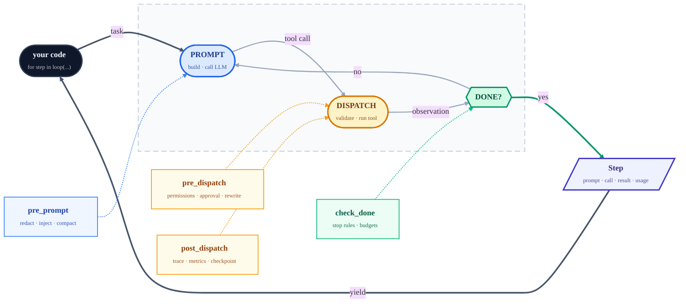

# looplet


[](https://github.com/hsaghir/looplet/actions/workflows/ci.yml)
[](https://codecov.io/gh/hsaghir/looplet)
[](https://pypi.org/project/looplet/)
[](https://www.python.org/downloads/)
[](LICENSE)
[](ROADMAP.md)

**looplet exposes the agent loop as an iterator, makes every step observable, and lets you compose behavior with hooks.**
Build LLM agents that call tools in a loop while you keep ordinary
Python control over every step — no graph DSL, no subclassing, no
vendor lock-in. **Zero runtime dependencies.**

> Elevator pitch: looplet is the tiny agent loop you can actually own.
> Yield every tool call, inspect every result, intercept any decision,
> and grow from a 30-line prototype to a production agent without
> switching frameworks.

```python
from looplet import composable_loop

for step in composable_loop(llm=llm, tools=tools, task=task, config=cfg, state=state):
    print(step.pretty())          # → "#1 ✓ search(query='…') → 12 items [182ms]"
    if step.tool_result.error:
        break                     # your loop, your control flow
```

```bash
pip install looplet               # core — zero third-party packages pulled in
pip install "looplet[openai]"     # works with OpenAI, Ollama, Together, Groq, vLLM, …
pip install "looplet[anthropic]"  # or Anthropic directly
```

---

## The simple story

Every looplet agent turn is the same small mechanism:

1. The LLM proposes a tool call.
2. The registry validates and dispatches it.
3. Hooks observe or steer the turn.
4. State records the step.
5. The loop yields a `Step` back to your `for` loop.

That is the whole mental model. Presets, skills, bundles, provenance,
native tool calling, and evals are useful layers around this mechanism;
they do not replace it.

```python
for step in composable_loop(llm=llm, tools=tools, state=state, config=config, hooks=hooks):
  print(step.pretty())
```

Start with ordinary Python code when you want full control. Start with a
bundle when you want to run or share a packaged capability:

```bash
python -m looplet run ./skills/coder "Fix the tests" --workspace .
python -m looplet blueprint ./skills/coder --workspace .
python -m looplet export-code ./skills/coder coder_agent.py
```

---

## Why it exists

Most agent frameworks give you `agent.run(task)` and a black box. When the
agent does something wrong at step 7, you can't step in between step 6 and
step 8. You end up forking the library or writing a second agent to babysit
the first.

`looplet` does the opposite: **the loop is the product, and hooks are the
extension API.** Every tool call is a `Step` object you can print, save,
or diff. Every decision the loop makes — what goes in the next prompt,
whether to compact context, whether to dispatch a dangerous tool, whether
to stop — is a `Protocol` method you implement in a few lines. Hooks
compose without inheritance. Nothing is hidden.

That one design choice is where the library's three practical superpowers
come from:

* **Shape agent behaviour** without forking — a 10-line hook can redact PII
  from every prompt, inject retrieved docs, rewrite tool arguments, or
  rate-limit calls to a single tool. Hooks are the extension point the
  framework *can't* close off because the loop itself is built on them.
* **Manage context on your terms** — `compact_chain(Prune, Summarize,
  Truncate)` is three hooks you wire together. Swap the strategy, change
  the budget, fire on a different threshold — no monkey-patching.
* **Debug and eval without a second tool** — `step.pretty()` is a
  human-readable trace, `ProvenanceSink` dumps every prompt the LLM saw
  plus every tool result into a diff-friendly directory, and pytest-style
  `eval_*` functions turn that trace into a regression suite. Your debug
  output *is* your eval harness.

That is the differentiation: looplet is not trying to be a complete
agent product. It is the control plane for people building one.

---

## The mental model — one picture

`looplet` is a `for` loop you own. The LLM proposes a tool call, the
registry dispatches it, hooks observe or steer, state records the result,
and the loop yields a `Step`. The diagram below expands that simple story
into the hook points you can customize:



Every amber box is a `Protocol` method. A hook is any object that
implements one or more of them — no base class, no inheritance:

```python
class RedactPII:
    def pre_prompt(self, state, log, ctx, step):
        return _scrub_emails(ctx)          # mutates the next LLM prompt

class RetryFlakyTool:
    def pre_dispatch(self, state, log, tc, step):
        if tc.tool == "web_search" and state.last_error:
            return Deny("retry with backoff", retry=True)

for step in composable_loop(..., hooks=[RedactPII(), RetryFlakyTool()]):
    ...
```

Ship-ready hooks already wired in: `ApprovalHook`, `PermissionHook`,
`CheckpointHook`, `ContextPressureHook`, `ThresholdCompactHook`,
`ProvenanceSink`, `TracingHook`, `MetricsHook`, `EvalHook`, plus the
`compact_chain(Prune, Summarize, Truncate)` context strategy. Use any,
all, or none — and [drop in your own](docs/hooks.md) in 10 lines.

---

## Your first agent (60 seconds)

```python
from looplet import BaseToolRegistry, OpenAIBackend, composable_loop
from looplet.tools import register_done_tool

llm = OpenAIBackend.from_env(model="gpt-4o-mini")  # reads OPENAI_API_KEY etc

tools = BaseToolRegistry()


@tools.tool
def greet(name: str) -> dict:
    """Greet someone by name."""
    return {"greeting": f"Hello, {name}!"}


register_done_tool(tools)

for step in composable_loop(
    llm=llm,
    tools=tools,
    task={"goal": "Greet Alice and Bob, then finish."},
    max_steps=5,
):
    print(step.pretty())
```

Works out of the box with any OpenAI-compatible endpoint. No Claude-only
SDK, no pydantic schema gymnastics, no LangChain memory objects.

Try it on your laptop against a local Ollama in three lines:

```bash
OPENAI_BASE_URL=http://127.0.0.1:11434/v1 \
OPENAI_API_KEY=ollama OPENAI_MODEL=llama3.1 \
python -m looplet.examples.hello_world
```

---

## When should you reach for `looplet`?

**Use it when you want to build your own agent loop and actually own
the details.** Concretely:

* You need to **insert logic at an exact phase** of the loop — before
  the prompt is built, before a tool is dispatched, after a tool
  returns — without forking a framework.
* You need to **swap context-management strategy at runtime** (prune,
  summarize, truncate, your own) without losing the rest of your stack.
* You need the loop to **pause for human approval**, then resume where
  it left off when approval arrives.
* You want **first-class debugging and evaluation** — a printable
  `Step`, a prompt-level provenance dump, pytest-style `eval_*`
  functions — without bolting on a second tool.
* You want **zero runtime dependencies** and a loop that cold-imports
  in ~300 ms (numbers in [docs/benchmarks.md](docs/benchmarks.md)).

**Don't reach for `looplet` if** you want `agent.run(task)` to handle
everything and return a string, or if you want a visual graph DSL — a
higher-level framework will feel more natural and the overlap in
features won't be worth the extra control `looplet` gives you.

---

## Examples

Real-LLM examples read `OPENAI_BASE_URL`, `OPENAI_API_KEY`, and
`OPENAI_MODEL` from the environment. Point them at Ollama or any
OpenAI-compatible endpoint, or use `--scripted` where available for a
deterministic no-model run.

```bash
python -m looplet.examples.hello_world                            # 30-line starter
python -m looplet.examples.hello_world --scripted                 # no model required
python -m looplet.examples.coding_agent "implement fizzbuzz"      # bash/read/write/edit/grep
python -m looplet.examples.coding_agent --trace ./traces/         # save full trajectory
python -m looplet.examples.coding_agent "implement add" --scripted --workspace /tmp/demo
python -m looplet.examples.data_agent --clean                     # approval + compact + checkpoints
python -m looplet.examples.data_agent --resume                    # resume from last checkpoint
python -m looplet.examples.data_agent --scripted --auto-approve   # no model required
```

Runnable bundles package the same primitives behind a portable folder:

```bash
python -m looplet list-bundles tests/fixtures --json
python -m looplet run tests/fixtures/coder_skill_bundle "Create a tiny add function with tests" --scripted --workspace /tmp/demo
python -m looplet export-code tests/fixtures/coder_skill_bundle /tmp/coder_agent.py  # exact local wrapper
python -m looplet package my_agent:build ./skills/my-agent --name my-agent --description "Run my agent."
python -m looplet wrap-claude-skill ./claude-skills/pdf ./skills/pdf
```

For a memorable custom agent, start with **Dependency Doctor**: point it
at a repo and it audits dependency files for security, license, and
maintenance risk, then produces a report card. It is concrete enough to
be useful, broad enough that most developers understand the pain, and it
shows looplet's core value: the user can watch every evidence-gathering
step and add guardrails without rewriting the agent.

```bash
# Load the v2 workspace; pass --workspace to point at the project to audit.
OPENAI_BASE_URL=http://127.0.0.1:11434/v1 \
OPENAI_API_KEY=ollama OPENAI_MODEL=llama3.1 \
python -c "from looplet import workspace_to_preset; \
p = workspace_to_preset('examples/dep_doctor.workspace', runtime={'workspace': '/path/to/project'})"
```

Other example directions that show off the same infrastructure:
`examples/git_detective.workspace/` for repo-health analysis,
`examples/threat_intel.workspace/` for local-first security briefings, and
`examples/coder.workspace/` for a coding agent with bash/read/write/edit/test
tools. Each is a self-contained Composable Harness Workspace that
round-trips losslessly with an `AgentPreset` via `preset_to_workspace`
/ `workspace_to_preset`.

```bash
# More dogfood — load each workspace and run a scripted loop.
python -m looplet.examples.hello_world --scripted
python -m looplet.examples.ollama_hello --scripted
python -m looplet.examples.coding_agent "Implement add" --scripted --workspace /tmp/demo
python -m looplet.examples.data_agent --scripted --auto-approve --clean
```

Plus [`scripted_demo.py`](src/looplet/examples/scripted_demo.py) —
a scripted `MockLLMBackend` run used only to record the GIF above.
Not a usage reference.

---

## Learn more

| Doc | What's in it |
| --- | --- |
| [docs/tutorial.md](docs/tutorial.md) | Build your first agent in 5 steps |
| [docs/hooks.md](docs/hooks.md) | Writing and composing hooks |
| [docs/skills.md](docs/skills.md) | Lazy skills, runnable bundles, blueprints, and Claude Skill wrapping |
| [docs/evals.md](docs/evals.md) | pytest-style agent evaluation |
| [docs/provenance.md](docs/provenance.md) | Capturing prompts + trajectories |
| [docs/recipes.md](docs/recipes.md) | Ollama, OTel, MCP, cost accounting, checkpoints |
| [docs/benchmarks.md](docs/benchmarks.md) | Cold-import time & dep footprint vs alternatives |
| [docs/faq.md](docs/faq.md) | FAQ, including "why not LangGraph?" |
| [ROADMAP.md](ROADMAP.md) | What's planned, what's frozen, what's out of scope |
| [CONTRIBUTING.md](CONTRIBUTING.md) | Dev setup, conventions, PR checklist |
| [CHANGELOG.md](CHANGELOG.md) | Release notes |

---

## Stability

`looplet` follows [SemVer](https://semver.org/). Pre-`1.0`, minor versions
may introduce breaking changes as the design stabilises — pin conservatively:

```toml
looplet>=0.1.8,<0.2
```

See [ROADMAP.md § v1.0 API contract](ROADMAP.md#v10-api-contract) for the
frozen surface and the path to `1.0`.

## Contributors

Thanks to everyone who has contributed to `looplet`:

- [@mvanhorn](https://github.com/mvanhorn) - "Why not LangGraph?" FAQ (#17)

See [CONTRIBUTING.md](CONTRIBUTING.md) for how to get started.

## Contributing

Contributions welcome: bug reports, docs, backends, examples, evals.
Start with [CONTRIBUTING.md](CONTRIBUTING.md) and
[docs/good-first-issues.md](docs/good-first-issues.md). Security issues
go through [SECURITY.md](SECURITY.md).

## License

Apache 2.0. See [LICENSE](LICENSE).
