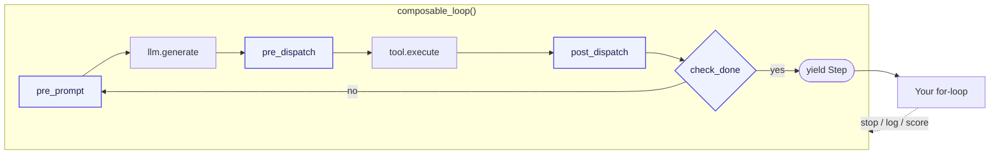

---
hide:
  - navigation
  - toc
---

<div class="hero" markdown>

<p class="hero-eyebrow">One iterator · Observable steps · Composable hooks</p>

# The agent loop you can actually own.

<p class="hero-sub" markdown>
**looplet** exposes the agent loop as an iterator, makes every step
observable, and lets you compose behavior with hooks. The LLM proposes a
tool call, the registry dispatches it, hooks observe or steer, state
records the step, and the loop yields control back to you. No graph DSL,
no agent runtime, no hidden state. Works with any OpenAI-compatible
endpoint or Anthropic directly.
</p>

<p class="hero-badges" markdown>
[](https://pypi.org/project/looplet/)
[](https://pypi.org/project/looplet/)
[](https://github.com/hsaghir/looplet/blob/master/LICENSE)
[](https://github.com/hsaghir/looplet/actions)
[](https://github.com/hsaghir/looplet)
</p>

<div class="hero-cta">
  <a href="quickstart/" class="md-button md-button--primary">Quickstart →</a>
  <a href="tutorial/" class="md-button">5-step tutorial</a>
  <a href="https://github.com/hsaghir/looplet" class="md-button">GitHub ⭐</a>
</div>

</div>

<div class="stats-row" markdown>

<div class="stat" markdown>
**289ms**
{ .stat-num }

Cold import
{ .stat-label }
</div>

<div class="stat" markdown>
**0**
{ .stat-num }

Runtime deps
{ .stat-label }
</div>

<div class="stat" markdown>
**4**
{ .stat-num }

Hook protocols
{ .stat-label }
</div>

<div class="stat" markdown>
**1,492**
{ .stat-num }

Tests, ~1s
{ .stat-label }
</div>

</div>

=== "Run one"

    ```python
    from looplet import composable_loop

    for step in composable_loop(llm=llm, tools=tools, task=task, config=cfg, state=state):
        print(step.pretty())          # "#1 search(query='…') → 12 items [340ms]"
        if step.usage.total_tokens > BUDGET:
            break                      # your loop, your control flow
    ```

=== "Install"

    ```bash
    pip install looplet                  # core — zero third-party packages
    pip install "looplet[openai]"        # OpenAI, Ollama, Groq, Together, vLLM
    pip install "looplet[anthropic]"     # Anthropic
    ```

=== "See it"

    { loading=lazy }

---

## How it works

Every turn follows the same five-step story:

1. The LLM proposes a tool call.
2. The registry validates and dispatches it.
3. Hooks observe or steer the turn.
4. State records the step.
5. The loop yields a `Step` to your code.

Bundles, presets, provenance, and evals all compile into this same
mechanism.



Four hook methods on any Python object. Implement only the ones you
need. The loop uses `hasattr` — no base class, no registration.

---

## The promise

1. **Own the loop.** Your code iterates over `Step` objects and can stop,
   log, approve, score, or redirect at any point.
2. **Compose behavior.** Hooks are plain Python objects. Add redaction,
   permission checks, compaction, metrics, or quality gates without
   subclassing a framework.
3. **Keep the trace.** The same step stream powers live debugging,
   provenance, replay, and pytest-style evals.
4. **Package capabilities.** Skills and bundles let you share a runnable
    agent folder while keeping the core loop inspectable Python.

## Why looplet?

<div class="grid cards" markdown>

-   :material-rocket-launch:{ .lg .middle } **Fast to start, fast to run**

    ---

    289 ms cold import. Zero runtime dependencies. `pip install` stays
    snappy on serverless and short-lived scripts.

    [:octicons-arrow-right-24: Benchmarks](benchmarks.md)

-   :material-puzzle:{ .lg .middle } **Composable by Protocol**

    ---

    Four `@runtime_checkable` hook methods. Any object implementing
    one or more is a hook. No base classes, no registration.

    [:octicons-arrow-right-24: Hooks](hooks.md)

-   :material-eye:{ .lg .middle } **Observable by default**

    ---

    `step.pretty()`, `ProvenanceSink`, and `eval_*` all read the
    same `Step` dataclass. One artifact, three uses.

    [:octicons-arrow-right-24: Provenance](provenance.md)

-   :material-shield-lock:{ .lg .middle } **Safe by design**

    ---

    `redact=` scrubs PII **before** the provider sees it *and* before
    the trace is written. No wrapping-order footguns.

    [:octicons-arrow-right-24: Pitfalls](pitfalls.md)

-   :material-arrow-decision:{ .lg .middle } **Compose agents as tools**

    ---

    Any looplet agent is a function that returns a result. Wrap it
    in a `ToolSpec` and plug it into the next agent.

    [:octicons-arrow-right-24: Recipes](recipes.md)

-   :material-test-tube:{ .lg .middle } **Debugging is evaluation**

    ---

    What you do while debugging (`print(step.pretty())`) is a
    trajectory. Evals are pytest-style functions over the same data.

    [:octicons-arrow-right-24: Evals](evals.md)

</div>

---

## See the difference

=== "Hidden loop (most frameworks)"

    ```python
    from langgraph.prebuilt import create_react_agent

    agent = create_react_agent(
        model=llm,
        tools=[search, fetch],
        state_schema=State,
    )
    result = agent.invoke({"messages": [task]})
    # Where does the loop stop?
    # Where does the tool call happen?
    # How do I intercept it?
    # → read the framework source.
    ```

=== "Loop-is-product (looplet)"

    ```python
    for step in composable_loop(
        llm=llm, tools=tools, task=task,
        hooks=[BudgetCap(10_000), Redactor()],
    ):
        if step.tool_call.tool == "delete":
            if not approve(step):           # (1)
                break
        log(step)                            # (2)
    ```

    1.  Intercept any tool call with ordinary Python — no custom graph
        node needed.
    2.  One `Step` object is the trace, the eval context, and the
        checkpoint unit.

---

## Custom agent example

Start with **Dependency Doctor** if you want a demo people remember:
point it at a repo and it audits dependency files for security, license,
and maintenance risk. The agent is useful, concrete, and shows the
looplet difference: every lookup, warning, and final claim is visible as
a step you can log, gate, replay, or evaluate.

```bash
# Load the workspace; pass --workspace to point at the project to audit.
OPENAI_BASE_URL=http://127.0.0.1:11434/v1 \
OPENAI_API_KEY=ollama OPENAI_MODEL=llama3.1 \
python -c "from looplet import workspace_to_preset; \
p = workspace_to_preset('examples/dep_doctor.workspace', runtime={'workspace': '/path/to/project'})"
```

Then explore `examples/git_detective.workspace/` for codebase-health reports,
`examples/threat_intel.workspace/` for local-first security briefings, and
`examples/coder.workspace/` for a coding-agent reference implementation —
each is a self-contained Workspace under
[`examples/`](https://github.com/hsaghir/looplet/tree/master/examples)
that round-trips losslessly with an `AgentPreset` via `preset_to_workspace`
/ `workspace_to_preset`.

```bash
# More dogfood — load each workspace and run a scripted loop.
python -m looplet.examples.hello_world --scripted
python -m looplet.examples.ollama_hello --scripted
python -m looplet.examples.coding_agent "Implement add" --scripted --workspace /tmp/demo
python -m looplet.examples.data_agent --scripted --auto-approve --clean
```

---

## Honest benchmarks

All numbers regenerate in one command on a fresh Python 3.11 venv.
See [Benchmarks](benchmarks.md) for the full methodology.

<div class="bench" markdown>

<div class="bench-row" style="--pct:7.3%;"  markdown>
**looplet** <span class="bench-bar"></span> <span class="bench-val">289 ms · 0 deps</span>
</div>
<div class="bench-row" style="--pct:47.4%;" markdown>
strands-agents <span class="bench-bar"></span> <span class="bench-val">1,885 ms · 6 deps</span>
</div>
<div class="bench-row" style="--pct:57.7%;" markdown>
LangGraph <span class="bench-bar"></span> <span class="bench-val">2,294 ms · 31 deps</span>
</div>
<div class="bench-row" style="--pct:60.6%;" markdown>
Claude Agent SDK <span class="bench-bar"></span> <span class="bench-val">2,409 ms · 13 deps</span>
</div>
<div class="bench-row" style="--pct:100%;"  markdown>
Pydantic AI <span class="bench-bar"></span> <span class="bench-val">3,975 ms · 12 deps</span>
</div>

</div>

<small>Cold-import time, median of 9 fresh subprocess runs. Python 3.11.13, Linux x86_64, PyPI wheels from 2026-04-21.</small>

---

## Start here

<div class="grid cards" markdown>

-   :material-speedometer:{ .lg .middle } **[Quickstart](quickstart.md)**

    ---

    Install. Run. Understand the loop in five minutes.

-   :material-school:{ .lg .middle } **[Tutorial](tutorial.md)**

    ---

    Build an agent with hooks, context management, crash-resume, and
    approval — in five steps.

-   :material-book-open-variant:{ .lg .middle } **[Hooks](hooks.md)**

    ---

    The four extension points. Recipes for every common pattern.

-   :material-chart-bar:{ .lg .middle } **[Evals](evals.md)**

    ---

    pytest-style scoring over the same trajectory you debug with.

-   :material-database-eye:{ .lg .middle } **[Provenance](provenance.md)**

    ---

    Capture every prompt and step to a diff-friendly directory.

-   :material-book-open-page-variant:{ .lg .middle } **[Recipes](recipes.md)**

    ---

    Ollama, OTel, MCP, cost accounting, checkpoints.

-   :material-alert-circle:{ .lg .middle } **[Pitfalls](pitfalls.md)**

    ---

    Ten sharp edges worth knowing — with the "right way" for each.

-   :material-speedometer-medium:{ .lg .middle } **[Benchmarks](benchmarks.md)**

    ---

    Cold import and dependency footprint, with the harness.

</div>

---

## Extension points at a glance

<div class="grid cards" markdown>

-   **`pre_prompt`**

    Inject context into the next prompt. Context managers,
    retrieval-augmented briefings, step-specific guidance.

-   **`pre_dispatch`**

    Intercept a tool call before it runs. Cache hits, permission
    gates, argument rewriting, approval flows.

-   **`post_dispatch`**

    React to a tool result. Duplicate-call warnings, error remediation
    messages, metric collection, streaming events.

-   **`check_done`**

    Reject premature completion. Quality gates, minimum-evidence
    thresholds, required-tool checks.

</div>

---

## Talks and writing

- :material-post: **[Blog: "The loop is the product"](https://hsaghir.github.io/engineering/the-loop-is-the-product/)** — the design argument behind the library.
- :material-github: **[THIRD_PARTY_USERS.md](https://github.com/hsaghir/looplet/blob/master/THIRD_PARTY_USERS.md)** — who is building on looplet.

---

<p class="home-footer" markdown>
[GitHub](https://github.com/hsaghir/looplet){ .md-button }
[PyPI](https://pypi.org/project/looplet/){ .md-button }
[Blog](https://hsaghir.github.io/engineering/the-loop-is-the-product/){ .md-button }
</p>
